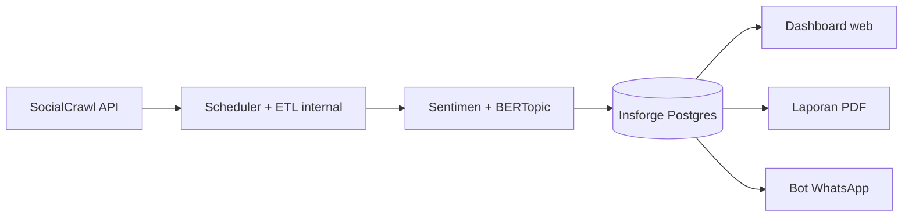

# PRD: Dashboard Monitoring Sentimen Sosial Media

2026-09-18 · @Someone

## Ringkasan produk

Dashboard monitoring sentimen media sosial untuk ASA Group: mengambil post DAN komentar dari SocialCrawl API, lalu menyajikan sentimen (positif/negatif/netral), topik, chatbot WhatsApp, laporan PDF, dan notifikasi harian.

Komentar dianalisis terpisah dari post karena reaksi publik yang paling tajam sering muncul di kolom komentar, bukan konten utamanya.

Target pengguna: instansi pemerintah daerah — pilot pertama Pemkot Denpasar, dirancang agar template-nya bisa dipakai ulang oleh Pemda lain.

Keluaran utama:

- Dashboard web (tren sentimen, breakdown topik)
- Chatbot WhatsApp untuk tanya jawab data
- Laporan PDF terjadwal
- Notifikasi WhatsApp harian saat ada anomali sentimen

## Arsitektur sistem

1. SocialCrawl API mengambil post dan komentar dari tiap platform yang dipantau
2. Scheduler internal (cron job dalam aplikasi, mis. node-cron/APScheduler) menjalankan ETL terjadwal: normalisasi, dedup, memicu job analisis
3. Sentimen (IndoBERT + eskalasi DeepSeek) dan topik (BERTopic) dianalisis
4. Hasil disimpan di Insforge (PostgreSQL) dengan RLS multi-tenant
5. Tiga output dibaca dari data tersimpan: dashboard web, laporan PDF (dijadwalkan scheduler), bot WhatsApp (Kirimdev)

Antrean job (urutan crawl → sentimen → topik → notifikasi) dikelola lewat tabel job di Postgres, atau BullMQ+Redis kalau butuh retry lebih robust.

## Ruang lingkup pengambilan data

Dua jenis data diambil dari SocialCrawl untuk tiap platform yang dipantau:

- Post/konten utama — endpoint post per platform (mis. `/v1/instagram/post`, `/v1/tiktok/video`)
- Komentar — endpoint comments per platform (mis. `/v1/instagram/comments`, `/v1/tiktok/comments`), diambil terpisah dan ditandai `parent_post_id`

| Aspek | Ketentuan |
| --- | --- |
| Platform | ditentukan saat implementasi sesuai kebutuhan bisnis |
| Frekuensi crawl | terjadwal via scheduler internal (cron job), interval disesuaikan volume dan budget credit |
| Paging | ikuti `next_cursor`, hentikan saat `has_more:false` |
| Caching | cek field `cached` sebelum re-query handle/keyword yang sama dalam window pendek |

## Skema database (Insforge PostgreSQL)

Semua tabel memakai RLS untuk isolasi multi-tenant, mengikuti pola yang sudah dipakai di proyek serupa.

| Tabel | Isi |
| --- | --- |
| raw\_posts | post mentah (platform, author, content, posted\_at, raw\_json, request\_id) |
| raw\_comments | komentar mentah dengan parent\_post\_id, author, content, posted\_at |
| sentiment\_scores | label sentimen per post/komentar (target\_type, target\_id, label, confidence, model\_used, profile\_version\_id) |
| topics | hasil BERTopic per batch run (topic\_id, label, keywords, run\_date) |
| topic\_assignments | relasi many-to-many post/komentar ke topics |
| daily\_rollup | materialized view: jumlah post, breakdown sentimen, top topik per hari |
| dedup\_log | hash konten untuk deteksi duplikat sebelum masuk pipeline analisis |
| org\_profile | profil sudut pandang institusi (nama, tipe, area fokus, entitas terkait, aturan konteks) untuk acuan klasifikasi sentimen, disimpan berversi (profile\_version) |

raw\_posts dan raw\_comments dipartisi per bulan untuk menjaga performa query saat data menumpuk.

## Profil sudut pandang pengguna (perspective profile)

Sentimen dievaluasi dari sudut pandang institusi pengguna, bukan sudut pandang netral generik — kritik terhadap layanan publik dihitung negatif bagi pemerintah, sementara konten yang sama bisa netral bagi organisasi lain.

Pengaturan yang diisi admin per organisasi:

- Nama dan jenis institusi (mis. "Pemerintah Kota Denpasar", tipe: pemerintah kota/kabupaten/provinsi)
- Area tanggung jawab yang dipantau (mis. kebersihan, infrastruktur jalan, layanan publik, kesehatan, pendidikan)
- Daftar entitas terkait (kepala daerah, dinas, program unggulan) agar tetap dikenali saat disebut spesifik
- Aturan konteks tambahan (opsional), mis. "keluhan soal jalan rusak = negatif (isu pelayanan publik)"

Profil ini disuntikkan sebagai konteks system prompt ke tahap eskalasi LLM (DeepSeek) saat klasifikasi sentimen, sehingga hasil sentimen konsisten dengan sudut pandang institusi.

Template default disediakan untuk kategori "Pemerintah Daerah" agar bisa dipakai ulang untuk klien Pemda lain tanpa membangun dari nol.

Perubahan profil disimpan berversi (profile\_version) — hasil sentimen lama tetap merujuk ke versi profil saat dianalisis, supaya histori tren tidak berubah retroaktif kalau profil diedit nanti.

## Pipeline analisis sentimen

Diterapkan ke post dan komentar secara terpisah, dievaluasi dari sudut pandang profil institusi yang aktif (lihat Profil sudut pandang pengguna):

1. Preprocessing: dedup (dedup\_log), normalisasi bahasa gaul (kamus seperti colloquial-indonesian-lexicon), filter spam/bot
2. Klasifikasi tier pertama: IndoBERT/IndoBERTweet untuk kecepatan dan biaya rendah — sentimen umum, belum mempertimbangkan sudut pandang institusi
3. Eskalasi ke DeepSeek untuk kasus confidence rendah dari tier pertama, atau kasus yang maknanya bisa berbeda dari sudut pandang institusi (mis. kritik layanan publik) — profil organisasi disuntikkan sebagai konteks system prompt
4. Simpan label (positif/negatif/netral), skor confidence, model yang dipakai, dan profile\_version\_id yang jadi acuan ke sentiment\_scores

## Pipeline analisis topik (BERTopic)

Berjalan sebagai batch job Python terpisah, dipanggil oleh scheduler internal (cron job) — bukan real-time per-post.

- Model embedding: sentence-transformers multilingual (`paraphrase-multilingual-MiniLM-L12-v2`) atau embedding IndoBERT untuk akurasi lebih tinggi
- Jadwal: batch harian (malam hari), mengelompokkan post dan komentar 24 jam terakhir
- Hasil disimpan ke topics dan topic\_assignments
- Dashboard menampilkan breakdown sentimen per topik, contoh: topik "antrian check-in" — 62% negatif, naik 3x dari minggu sebelumnya

## Chatbot WhatsApp (Kirimdev)

Dibangun di atas kirimdev-hermes (self-hosted WhatsApp AI gateway open source dari Kirimdev), dipanggil langsung dari layanan backend aplikasi tanpa perantara workflow tool.

Kapabilitas:

- Tanya jawab data agregat (mis. "sentimen hari ini gimana?") — query langsung ke daily\_rollup
- Tanya jawab bebas dari data mentah — pakai RAG dengan ekstensi pgvector di Insforge, embedding atas raw\_posts dan raw\_comments

Kontrol akses: bot memverifikasi nomor pengirim sebelum menjawab pertanyaan data internal, agar tidak ada nomor tak berwenang yang bisa menarik data sensitif.

## Laporan PDF otomatis

Digenerate terjadwal, berisi ringkasan sentimen, tren, dan topik teratas periode berjalan.

- Tools render: Puppeteer/Playwright (HTML+chart ke PDF) atau WeasyPrint (Python, CSS-to-PDF) untuk layout lebih sederhana
- Jadwal generate: via scheduler internal (cron job)
- Distribusi: dikirim sebagai attachment lewat Kirimdev, atau tautan unduh dari dashboard

## Notifikasi WhatsApp harian dan deteksi anomali

Trigger: scheduler internal (cron job) harian → cek anomaly detection → kirim via Kirimdev jika ambang terlampaui.

- Logika anomali: bandingkan rasio sentimen negatif hari ini terhadap baseline (rata-rata bergerak 7/30 hari), bukan threshold statis, untuk menghindari false alarm di volume kecil
- Format pesan: ringkas — jumlah post, breakdown sentimen, topik pemicu jika ada lonjakan negatif
- Observability: alert internal ke WhatsApp jika job scheduler internal (crawl/sentimen/topik) gagal — retry/backoff diimplementasikan di kode, plus webhook status Kirimdev dan dead-letter queue-nya untuk pesan gagal terkirim

## Non-functional requirements

| Aspek | Ketentuan |
| --- | --- |
| Performa | partitioning bulanan pada raw\_posts/raw\_comments, materialized view daily\_rollup untuk query dashboard |
| Keamanan | RLS multi-tenant di semua tabel, verifikasi nomor pengirim pada bot WhatsApp sebelum akses data |
| Biaya | manfaatkan field `cached` SocialCrawl untuk hindari query ulang, catat `request_id` untuk audit credit |
| Observability | webhook status Kirimdev dan dead-letter queue dimanfaatkan untuk alert kegagalan job scheduler internal |
| Error handling | job gagal tidak menghapus data parsial; retry dengan backoff mengikuti rate limit SocialCrawl (600 req/menit, 50 in-flight) |

## Fase implementasi

| Fase | Cakupan |
| --- | --- |
| 1. Fondasi | setup Insforge (skema tabel + RLS), koneksi SocialCrawl (post + komentar), scheduler + ETL dasar (custom) |
| 2. Sentimen | pipeline IndoBERT + eskalasi DeepSeek, tersimpan di sentiment\_scores |
| 3. Dashboard MVP | web dashboard baca dari daily\_rollup, breakdown sentimen dasar |
| 4. Topik | integrasi BERTopic batch job, breakdown sentimen per topik di dashboard |
| 5. Notifikasi | WhatsApp harian via Kirimdev + anomaly detection |
| 6. Laporan | PDF terjadwal |
| 7. Chatbot | kirimdev-hermes atau n8n AI Agent + RAG pgvector |

Catatan untuk AI coding agent: implementasikan berurutan sesuai fase di atas — tiap fase menghasilkan sistem yang bisa dites secara independen sebelum lanjut ke fase berikutnya.
